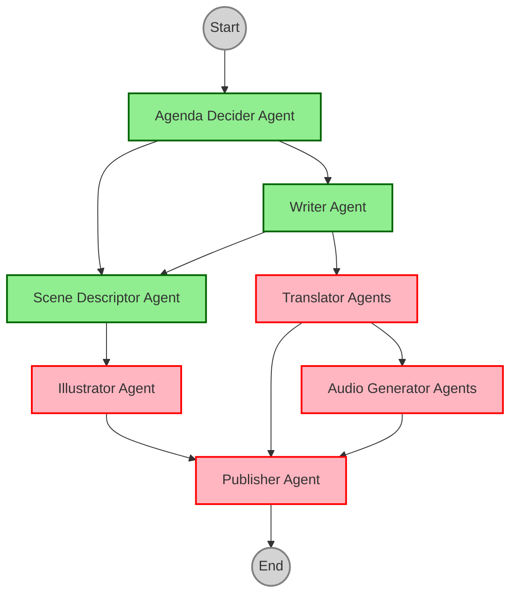

# Historinhas do Gemini

## Para crianças de todo o mundo 👧👦🌎

### Um mundo de histórias para sonhar ✨

📖🎧 Histórias multiculturais de 3 minutos para ler e ouvir na hora de dormir. 🌱 Promovendo valores e a alegria de aprender juntos! 🌈📚

## Visão Geral do Projeto

"Historinhas do Gemini" é um projeto encantador que visa criar e distribuir histórias multiculturais para crianças de 5 a 10 anos. Nosso objetivo é promover a leitura, o aprendizado de valores importantes e a conexão entre pais e filhos através de histórias envolventes e educativas. Utilizamos a tecnologia de IA para auxiliar na criação e distribuição das histórias, tornando o processo mais eficiente e acessível.

## Funcionalidades

* **Histórias Multiculturais:** Histórias que exploram diferentes culturas ao redor do mundo, apresentando personagens e cenários diversos.
* **Duração Ideal:** Histórias com cerca de 3 minutos de duração, perfeitas para a hora de dormir.
* **Formatos Múltiplos:** Histórias disponíveis para leitura e audição, proporcionando uma experiência completa.
* **Foco em Valores:** Cada história destaca um valor humano importante, como amizade, coragem, respeito e empatia.
* **IA na Criação:** A IA é utilizada para auxiliar na geração de ideias, escrita e ilustração das histórias.
* **Publicação no Instagram:** As histórias são publicadas no Instagram, alcançando um público amplo e diversificado.

## Arquitetura da Solução

O projeto utiliza uma arquitetura de agentes de IA para automatizar o processo de criação e publicação das histórias. Os principais agentes envolvidos são:

1.  **Agente Decisor de Pauta:** Define o tema da história, escolhendo um país, um valor humano e um evento relevante (se houver).
2.  **Agente Escritor:** Cria a história com base na pauta definida.
3.  **Agente Ilustrador:** Gera as ilustrações para a história.
4.  **Agentes Tradutores:** Traduzem a história para diferentes idiomas.
5.  **Agentes Geradores de Áudio:** Criam a narração em áudio da história.
6.  **Agente Publicador:** Formata e publica a história no Instagram.

## Exemplo de História Gerada

**Título:** Astrid e o Espírito Norueguês

**Resumo:** Uma jovem chamada Astrid vive em uma vila na Noruega e está animada para o Dia da Constituição. Quando um desafio inesperado surge, Astrid descobre a importância da perseverança e do "sisu", um valor norueguês, para superar obstáculos.

**(Ver a história completa no arquivo "Results on Google Colab.docx")**

## Imagem Promocional

![Crianças de diversas etnias e origens culturais, vestidas em roupas coloridas, de mãos dadas em uma ciranda em um campo florido. O céu ao fundo tem tons pastéis de rosa, azul e amarelo. No centro da imagem, em letras grandes e amigáveis, está o título "Historinhas do Gemini". Abaixo, em letras menores, o subtítulo "Para crianças do mundo todo". Na parte inferior da imagem, um breve resumo do projeto: "Histórias multiculturais de 3 minutos para ler e ouvir na hora de dormir. Promovendo valores e a alegria de aprender juntos!"](images/historinhas_diurno.png)

## Tecnologias Utilizadas

* Agent Development Kit (ADK)
* Modelos de linguagem generativos (Gemini)
* APIs de busca (Google Search)
* Modelos de geração de imagens
* Tecnologias de síntese de voz
* Instagram API

## Próximos Passos

* Desenvolvimento e aprimoramento dos agentes de IA.
* Implementação de novas funcionalidades, como personalização de histórias e interação com os usuários.
* Expansão para outras plataformas de publicação.
* Criação de mais histórias e conteúdo diversificado.

## Arquivos Importantes

Este projeto possui a seguinte estrutura de pastas com arquivos importantes a serem observados:

* [Notebook - Historinhas do Gemini](text/Historinhas_do_Gemini.ipynb): Jupyter Notebook com a implementação da prova de conceito deste projeto (testado no Google Colab).

* **`texts/`**: Contém documentos textuais relevantes.
    * [Plano de Projeto](texts/Plano_de_Projeto.docx): Plano de Projeto para o Historinhas do Gemini.
    * [Resumo Técnico da Solução](texts/Resumo_Tecnico_da_Solucao.docx): Detalhes técnicos da arquitetura da solução para o projeto.

* **`html/`**: Armazena arquivos HTML importantes para mostrar a solução pretendida e promover a ideia.

* **`images/`**: Imagens do projeto.

## Contribuição

Agradecemos o seu interesse em "Historinhas do Gemini"! Se você tiver alguma sugestão, ideia ou quiser contribuir com o projeto, entre em contato conosco.

## Licença

TBD
